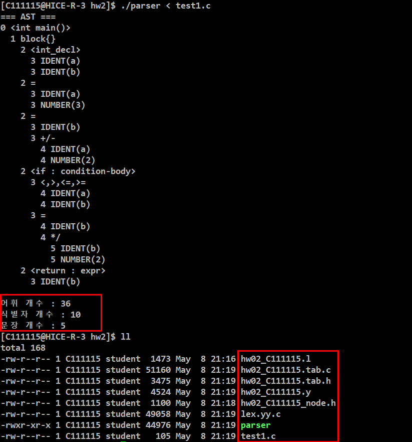

# 프로그래밍언어론 HW02 - Flex & Bison Parser

## 프로젝트 개요

본 프로젝트는 Flex와 Bison을 이용하여 구현한 간단한 Compiler Parser 과제입니다.

구현 내용은 다음과 같습니다.

- 어휘 분석(Lexical Analysis)
- 구문 분석(Syntax Analysis)
- AST(Abstract Syntax Tree) 생성
- 어휘 개수 / 식별자 개수 / 문장 개수 출력

간단한 C 스타일 문법을 지원합니다.

- 변수 선언
- 대입문
- 산술 연산
- if / else
- while
- return
- block statement

---

# 파일 구성

```text
hw02_C111115.l
hw02_C111115.y
hw02_C111115_node.h
```

---

# 실행 환경

- Linux
- Flex
- Bison
- GCC

---

# 컴파일 방법

```bash
bison -d hw02_C111115.y
flex -o lex.yy.c hw02_C111115.l
gcc hw02_C111115.tab.c lex.yy.c -o parser
```

---

# 실행 방법

```bash
./parser < test1.c
```

---

# 테스트 코드 예시

```c
int main() {
    int a,b;

    a = 3;
    b = a + 2;

    if (a < b)
        b = b * 2;

    return b;
}
```

---

# 실행 결과 예시

```text
=== AST ===
0 <int main()>
  1 block{}
    2 <int_decl>
      3 IDENT(a)
      3 IDENT(b)

...

어휘 개수 : 36
식별자 개수 : 10
문장 개수 : 5
```

---

# 테스트 실행 결과



---

# 주요 기능

- Flex 기반 Lexical Analyzer 구현
- Bison 기반 Parser 구현
- AST(Abstract Syntax Tree) 생성
- 재귀 기반 AST 출력
- Lexeme Count 출력
- Identifier Count 출력
- Statement Count 출력
